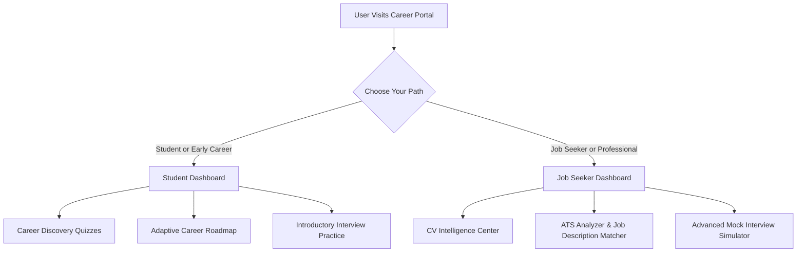
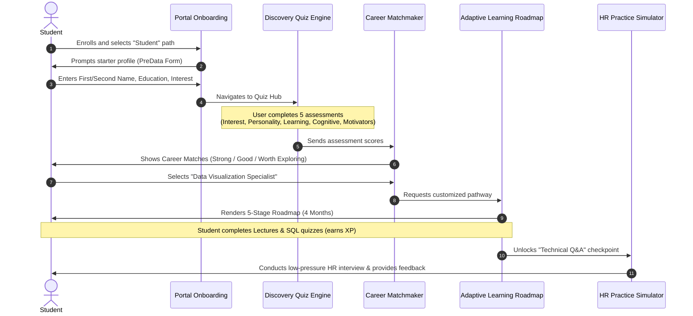
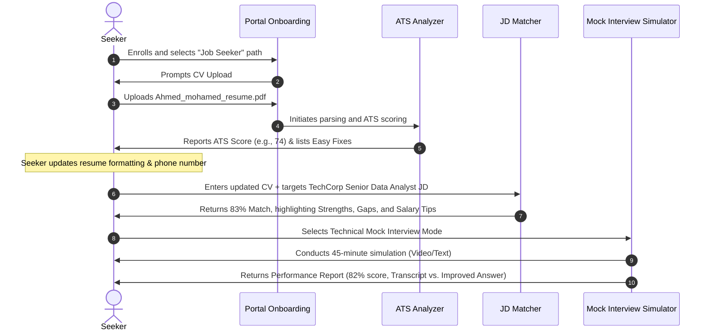

# Career Portal — Comprehensive Project Document & Specification

This document provides a detailed overview of the features, user flows, functional modules, and design guidelines for the AI-Powered Career Portal, compiled and structured directly from the platform's markdown files.

---

## 1. Project Overview & Target Audience

The Career Portal is an AI-powered, adaptive career readiness and development platform designed to guide users from self-discovery to successful employment. The system caters to two distinct user personas, each with a tailored product experience:

### Target User Personas
1. **Student / Undergrad Persona**: Focuses on self-discovery (Career Discovery Quizzes), career path matching, structured roadmap progression (milestone tracking, lectures, practice tasks), and low-pressure interview practice.
2. **Job Seeker / Early Career Professional Persona**: Focuses on immediate job-market readiness, CV analysis (ATS Analyzer, Job Description Matcher), salary negotiation strategy, and realistic mock interview simulations with granular, AI-driven performance reports.

---

## 2. Platform Modules & Features

### 2.1 Onboarding Module (`1-Onboarding`)
The gateway for establishing user identity, parsing qualifications, and branching the application interface.
*   **Path Selection (`Onboarding-1.mdx` / `OnboardingLight`)**:
    *   **Student/Early Career**: Focuses on career exploration, skill development, and interview practice. (Call to Action: *Start My Journey*)
    *   **Career Professional/Job Seeker**: Focuses on CV enhancement, interview preparation, and job placement. (Call to Action: *Get Interview-Ready*)
*   **CV Upload (`Onboarding-2.mdx` / `CvUpload`)**:
    *   Drag-and-drop or file-browse input zone (supports standard document formats).
    *   AI-powered parser extracting key skills, experiences, and career history.
    *   Alternative path for users without resumes: *Build your starter profile instead*.
*   **Starter Profile Form (`3.mdx` / `PreData`)**:
    *   Collects core details: First Name, Second Name, Education, Field of Interest, Experience Level, and Career Goal.

### 2.2 Dashboard Home Module (`2-Dashboard Home`)
A personalized, widget-based command center that adapts to the chosen user path.

#### Shared Features:
*   **Welcome Message**: Tailored greetings (e.g., "Welcome, Norhan!").
*   **Daily Streak Tracker**: A visual Monday–Sunday tracker measuring engagement consistency (e.g., "13 DAYS Streak").
*   **AI Mentor integration & Today's Tasks list**: Prompts actionable items to keep the user engaged daily.

#### Dashboard Variations:
1.  **Job Seeker Dashboard (`JobSeekerDashboard.mdx`)**:
    *   *Primary CTA*: "Start Mock Interview".
    *   *Quick Actions*: Mock Interviews (HR, technical, negotiation), ATS Analyzer, Ask AI Mentor, Job Description Matcher, Company Analysis.
    *   *Metrics Widgets*:
        *   **ATS Score**: Overall resume rating (e.g., 82%).
        *   **Interviews Done**: Total count of completed mock interviews (e.g., 16).
        *   **Improvement**: Progress tracker (e.g., +12%).
    *   *Today's Tasks*: Concrete action items (e.g., "Practice system design interview", "Update CV with new project", "Practice mock HR interview").
2.  **Student Dashboard (`StudentDashboard.mdx`)**:
    *   *Primary CTA*: "Take Career Discovery Quiz".
    *   *Quick Actions*: Start Discovery Assessments, Practice Interview (Low-pressure HR questions with feedback), Ask AI Mentor, Update Your Roadmap.
    *   *Roadmap Progress Widget*:
        *   **Excel & Data Fundamentals**: (e.g., 100% Completed).
        *   **SQL & Database Basics**: (e.g., 42% In Progress).
        *   **Data Visualization**: (e.g., Locked until prerequisites met).
    *   *Today's Tasks*: Discovery and baseline learning activities (e.g., "Complete SQL GROUP BY exercises", "Complete Learning Style quiz").

---

### 2.3 CV Intelligence Center (`3-CV Center`)
Provides automated resume evaluation, matching, and strategic negotiation tools.

*   **CV Parsing & Upload (`CV_ATS.mdx`)**:
    *   Active AI parsing upon uploading a resume (maximum size 5MB).
*   **ATS Result Report (`ATSResult.mdx`)**:
    *   **Consolidated ATS Score**: Out of 100 (e.g., 74 - "Decent! a few fixes will make a real difference").
    *   **Metric Counters**: Missing Keywords, Formatting Issues, Recruiter Red Flags.
    *   **Actionable Fixes (Examples)**:
        *   *Missing phone numbers* (auto-reject warning).
        *   *Missing portfolio links* (needed for recruiter work validation).
        *   *Visual elements/bar charts for skills* (ATS cannot read visual layouts; recommends plain text).
        *   *Generic objective statements* (e.g., "Seeking opportunities..." -> replaced by a 2-line impact summary).
*   **Job Description Matcher (`CV_JobDescription.mdx`)**:
    *   Dual inputs: Upload CV + paste job description text or upload JD PDF.
*   **JD Match Report (`CV_JobDescription_Result.mdx`)**:
    *   **Performance Metrics**: Overall Match Score (e.g., 83%), Match Quality Tier (e.g., "Strong Fit").
    *   **Contextual Details**: Position title, Company name, Location.
    *   **Strengths to Emphasize**: Highlighted experience matching JD needs (e.g., 3+ years of Python/Pandas experience, documented SQL query speed optimization of 40%, project management for engineering collaboration).
    *   **Critical Gaps**: Flags missing requirements (e.g., no Power BI experience, limited A/B testing experience, missing cloud keyword coverage like AWS).
    *   **Keyword Analysis**: Side-by-side comparison of present vs. missing keywords.
    *   **Salary Expectation Alignment**:
        *   Displays market range (e.g., $85k - $110k), user's target (e.g., $105k), and implied company budget (e.g., $95k - $115k).
        *   **Insider Negotiation Tip**: Tactical guidance on positioning and anchoring salary negotiations based on skills and experience.

---

### 2.4 Career Discovery Module — Students Only (`4-Career Discovery-Students only(Undergrads)`)
Assists students in discovering optimal career paths through structured psychological and cognitive assessments.

*   **Assessment Hub (`1.careerDiscovery.mdx`)**:
    *   Tracks progress through 5 key assessments:
        1.  **Career Interest (4 min)**: Identifies types of work activities that genuinely excite the user.
        2.  **Personality Traits (5 min)**: Understands working styles and optimal environments.
        3.  **Learning Readiness (4 min)**: Measures skill acquisition habits and resilience.
        4.  **Cognitive Abilities (4 min)**: Evaluates problem-solving frameworks.
        5.  **Motivators (4 min)**: Explores core drives during challenging periods.
*   **Quiz Engine (`2.careerDiscoveryQuiz.mdx` / `3.careerDiscoveryQuizEnd.mdx` / `4.careerDiscoveryQuizlaoding.mdx`)**:
    *   7 questions per assessment (e.g., Q1: "Which activity would you voluntarily do on a free day?", Q7: "Which environment energizes you most?").
    *   Includes explanation panels ("Why this Assessment?", "Goal", and "Total estimated time").
    *   *Features*: "Save and Exit", progress tracking, and custom transition loading animations ("Analyzing Your Responses...").
*   **Assessment Results (`5.careerDiscoveryQuiREsult.mdx`)**:
    *   Categorizes archetype profiles (e.g., "People Developer" - fulfilled by helping others grow).
    *   Lists core strengths, ideal career paths, and tailored developmental advice.
*   **Career Matchmaker Dashboard (`6.CareerOptions.mdx`)**:
    *   Calculates career matches (e.g., Strong Match, Good Potential, Worth Exploring) by correlating completed assessments and skill readiness.
    *   Breaks down *Why this fits you* and performs a *Skill gap analysis* for each option.
*   **Career Profile Page (`7.Careerprofile.mdx`)**:
    *   Deep dive into individual occupations (e.g., Data Visualization Specialist).
    *   Details core technical skills, design knowledge, entry-level requirements, day-to-day duties, growth paths (e.g., Senior BI Developer, Analytics Manager), and salary distributions (10th percentile, median, 90th percentile).

---

### 2.5 Adaptive Career Roadmap Module — Students Only (`5-Career-Roadmap(Students Only)`)
Converts matched career profiles into interactive learning pathways.

*   **Roadmap Overview (`1-Career Roadmap Overview.mdx` / `2-Career Roadmap Overview.mdx`)**:
    *   Visualizes a multi-stage timeline (e.g., Data Visualization Specialist: 4-month estimated completion).
    *   Acknowledges adaptive progression: *“It adapts as you complete quizzes, practice tasks, and interview checkpoints. The stronger your performance, the faster it evolves.”*
    *   **Roadmap Stages (Dynamic Example for Data Visualization Specialist)**:
        > [!NOTE]
        > Roadmap stages are dynamically generated and adapt based on the chosen career specialization. Below is an example of a 5-stage roadmap:
        1.  Data Visualization
        2.  SQL & Data Extraction (SELECT, JOIN, Aggregations, Filtering/Sorting)
        3.  BI Tools Mastery
        4.  Data Storytelling & Design
        5.  Real-World Simulation
*   **Milestone Tracker (`3-Career Roadmap details.mdx`)**:
    *   **Metrics**: Job-Readiness Score (e.g., 48%), Learning Streak, and Experience Points (XP) earned.
    *   **Stage Status Tracking**: Flags stages as *Completed*, *In Progress*, or *Locked*.
*   **Learning Module Detail (`4-Career Roadmap details.mdx`)**:
    *   Granular item checklist showing delivery formats:
        *   *Lectures*: (e.g., "Data types & structures", "Excel advanced formulas").
        *   *Practice Tasks*: (e.g., "Explain correlation vs. causation", "SQL timed challenge (AI graded)").
        *   *Interview Simulations*: (e.g., "Technical Q&A on SQL").

---

### 2.6 Mock Interview Simulator (`6-Mock Interviews-AI Avatar Interviewer`)
An advanced, video-enabled mock interview platform that provides quantitative grading and actionable review.

*   **Interview Mode Selector (`1-mock interview.mdx`)**:
    *   **Technical Interview (30-45 min)**: Role-specific hard skills, coding/architecture, tool proficiency, and best practices.
    *   **Salary Negotiation (10-15 min)**: Comp discussions, handling lowballs, benefits tactics, and counter-offer strategies.
    *   **HR Interview (15-20 min)**: Behavioral and culture-fit questions utilizing the STAR method.
    *   **Problem-Solving (45-60 min)**: Open-ended system architecture, case study, and scalability trade-off discussions.
*   **Setup Instructions (`2-mock interview instructions.mdx` / `3-Mock interview-before-start.mdx`)**:
    *   Sets preparation checks: finding a quiet space, maintaining clear tone, structured formatting, camera eye contact, and pacing.
*   **Active Interview Interface (`4-Mock interview-Questions.mdx`)**:
    *   Displays active question prompt (e.g., "Tell me about yourself..."), provides a "Start Answering" control, and shows non-verbal reminder tags.
*   **Practice History (`5-Mock interview-Interviews.mdx`)**:
    *   Chronological logs displaying: Date, Interview Type, Duration, Subject, Status (Completed/Failed), and Link to Feedback.
*   **Evaluation & Feedback Report (`6-Mock interview-Feedback.mdx` / `7-Mock interview-Report.mdx`)**:
    *   **Overall Score**: out of 100 (e.g., 82%).
    *   **Qualitative Summary**: (e.g., "Candidate demonstrates solid technical foundations... responses should include quantified outcomes...").
    *   **Category Analysis**:
        *   *Communication & Articulation* (graded out of 10): Structure, Clarity, Relevance, Explanation Simplicity.
        *   *Technical Depth* (graded out of 10): Fundamental Knowledge, Technical Explanation, Real-world Application, Decision Justification.
    *   **Transcript Improvement Tool**:
        *   Displays the user's detected transcript (e.g., *“So we had an internal dashboard that was slow...”*).
        *   Highlights weaknesses with `❌` indicators (e.g., *No measurable impact, Technical details are vague, Improvement not quantified*).
        *   Provides a rewritten `✅ Improved Answer` showing how to inject metrics, technical stack details, and structured outcomes.

---

### 2.7 AI Avatar Mentor Module (`7-AI Avatar Mentor`)
An omnipresent side panel or dedicated page providing continuous guidance.
*   **Core UI Elements (`AI Mentor.mdx`)**:
    *   Conversational interface with "How can I help you today?" greeting.
    *   "Attach" file button (allowing upload of resumes, JDs, or certificates).
    *   Direct links to other core modules: Dashboard, Mock Interviews, ATS Analysis, Company Analysis, and Performance Analytics.

---

## 3. Platform User Flows

### 3.1 Student / Undergrad User Journey

### 3.2 Job Seeker / Professional User Journey

---

## 4. Key Design Elements & UI Tokens

To ensure consistency in look and feel during front-end construction, the platform utilizes several signature UI blocks and layout systems:

| Component | UI Elements & Indicators | Relevant Markdown Source |
| :--- | :--- | :--- |
| **Global Navigation** | Sidebar including: Dashboard, AI Mentor, Mock Interviews, ATS Analysis, Company Analysis, Performance Analytics. | Multiple pages |
| **Activity Streak** | Weekly letter layout (Mon, Tue, Wed, Thu, Fri, Sat, Sun) + numerical days counter (e.g., "13 DAYS"). | `JobSeekerDashboard.mdx` |
| **Onboarding Selection** | Grid of dual-path cards. CTA options: "Start My Journey" vs. "Get Interview-Ready". | `Onboarding-1.mdx` |
| **ATS Score Widget** | Large radial or circular percentage gauge (e.g., 74% or 82%). | `JobSeekerDashboard.mdx`, `ATSResult.mdx` |
| **Match Quality Label** | Color-coded status pills: `Strong Match` (Green), `Good Potential` (Yellow), `Worth Exploring` (Blue). | `6.CareerOptions.mdx` |
| **Interactive Quiz** | Centered active question container, A-E option buttons, progress bar (e.g. "1/7 Questions"), and info panels. | `2.careerDiscoveryQuiz.mdx` |
| **Adaptive Roadmap** | Chronological milestone timeline cards with status indicators: `Completed`, `In Progress` (showing % completion), or `Locked` (padlock symbol). | `3-Career Roadmap details.mdx` |
| **Interview Transcripts** | Alternating side-by-side chat boxes comparing `❌ Candidate Transcript` with `✅ Improved Answer` using green checkmarks and red cross icons. | `6-Mock interview-Feedback.mdx` |

---

## 5. Architectural & Implementation Insights

### 5.1 AI-Driven Parsing & Scoring Engine
*   **ATS Engine**: Needs rule-based and LLM-driven parsers to inspect contact blocks, detect skills formats (rejecting non-extractable structures like SVG charts), and calculate density indices of industry-standard keywords.
*   **JD Matching**: Operates via semantic similarity models that match resume skill nodes against requirements in the job posting, highlighting gaps (missing nodes) and strengths (matching nodes).
*   **Negotiation Advice**: Requires mapping targeted roles to regional compensation data, calculating target percentiles, and suggesting anchoring ranges.

### 5.2 Interactive Simulation Engine
*   **Speech-to-Text Transcriber**: Converts audio answers into text transcripts.
*   **STAR Evaluator**: Analyzes answers against the STAR method (Situation, Task, Action, Result). It checks for quantified metrics (e.g., percentage improvements, time reductions) and architecture explanations.
*   **AI Avatar Video Overlay**: Simulates a live video feed of an interviewer avatar while directing user focus toward camera eye contact.

### 5.3 Gamified Learning Engine
*   **XP Engine**: Awards XP upon completion of lectures, quizzes, and tasks.
*   **Streak Tracker**: Increments consecutive daily usage counters.
*   **Roadmap Re-Calculator**: Unlocks or accelerates roadmap milestones based on the user's performance scores in practice tasks and mock interviews.
